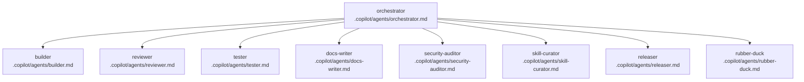

# Copilot Fleet for Obsidian GitHub Copilot Plugin

This repository includes a small fleet of Copilot CLI / VS Code Copilot custom agents and skills. They are plain Markdown files with YAML frontmatter, so future human and AI contributors can inspect, invoke, and improve the team's operating principles.

## Invocation

- Copilot CLI: `copilot --agent orchestrator "add a streaming progress indicator"`
- VS Code Copilot Chat: `@orchestrator add a streaming progress indicator`
- Human mode: read the relevant agent prompt, follow its checklist, and keep the same quality bar.

## Operating model

Invoke `orchestrator` first for any non-trivial change. The orchestrator plans, decomposes, tracks SQL todos, and dispatches work to specialists; it does **not** implement the work itself. Builders build, testers test, reviewers review, docs-writers document, and security-auditors threat-model sensitive changes.

Skills in `.copilot/skills/` wrap repeated workflows such as building, testing, threat-model diffs, and release cutting.
