# GitHub Copilot Agent for Obsidian

> Bring GitHub Copilot, GitHub Models, Azure Foundry BYOK, and MCP tools directly into your vault — with default-deny permissions and an audit trail you can inspect.

[](https://github.com/j-dahl/Obsidian-GithubCopilot-Plugin/actions/workflows/ci.yml)
[](https://github.com/j-dahl/Obsidian-GithubCopilot-Plugin/releases)
[](LICENSE)
[](https://github.com/j-dahl/Obsidian-GithubCopilot-Plugin/releases)
[](https://obsidian.md)

## What this is

GitHub Copilot Agent is the agent-first GitHub Copilot plugin for Obsidian: a desktop community plugin that turns your vault into a safe, tool-using AI workspace. Other Obsidian plugins already provide Copilot chat and inline completions; this plugin focuses on MCP tools, multi-backend model access, cached credential reuse, explicit permissions, and an audit trail you can inspect.

## Screenshots


## Features

### Backends

- GitHub Models through `https://models.github.ai/inference`.
- GitHub Copilot API for users with an active Copilot subscription.
- Azure Foundry v1 endpoint support for bring-your-own-key deployments.
- Azure OpenAI Classic support for legacy deployment-scoped resources.
- One provider interface so chats, tools, and settings behave consistently.

### Models

- Live GitHub Models catalog refresh.
- Tool-calling and streaming capability filters.
- Suggested defaults for fast prototyping and long-context note work.
- Per-backend model, deployment, endpoint, and key settings.

### MCP

- Auto-discovers MCP configs from popular editors and assistants.
- Supports stdio, Streamable HTTP, and legacy SSE transports.
- Namespaces tools by server so names never collide.
- Shows server descriptions, tool annotations, and arguments before approval.

### Security

- Strict, Balanced, and Trusted Workspace permission presets.
- Default-deny posture for risky reads, writes, network calls, and destructive tools.
- Prompt-injection warnings and untrusted-content wrapping.
- JSONL audit log with redaction, rotation, and an in-app Agent Activity panel.

### Tools

- Native vault tools for reading the active file, searching notes, and creating notes.
- MCP tool bridge for filesystem, GitHub, Excalidraw, terminal, and custom servers.
- Optional native ExcalidrawAutomate integration when the Excalidraw plugin is installed.
- Local CLI workflows through tools such as `notesmd-cli`.

## How this compares to other GitHub Copilot Obsidian plugins

| Capability                                                      | pierrad/obsidian-github-copilot (39k DL) | go2engle/obsidian-github-copilot-integration (145 DL) | **github-copilot-agent (this plugin)**               |
| --------------------------------------------------------------- | ---------------------------------------- | ----------------------------------------------------- | ---------------------------------------------------- |
| Inline ghost-text completions                                   | ✅                                       | ✅                                                    | ❌ (planned in v0.2)                                 |
| Chat sidebar                                                    | ✅                                       | ✅                                                    | ✅                                                   |
| MCP client support                                              | ❌                                       | ❌                                                    | ✅ multi-editor config discovery                     |
| Agent tool-calling                                              | ❌                                       | ❌                                                    | ✅ 8 native + any MCP tool                           |
| Multi-backend (Models / Copilot / Azure Foundry / Azure OpenAI) | ❌ Copilot only                          | ❌ Copilot only                                       | ✅                                                   |
| Cached `gh` / Copilot CLI token reuse                           | partial (device flow)                    | ✅ Copilot CLI only                                   | ✅ env / gh / Copilot CLI keychain / VS Code Copilot |
| Permission gate (Strict / Balanced / Trusted)                   | ❌                                       | ❌                                                    | ✅                                                   |
| JSONL audit log with redaction                                  | ❌                                       | ❌                                                    | ✅                                                   |
| Prompt-injection wrapper                                        | ❌                                       | ❌                                                    | ✅ base64 untrusted envelopes                        |
| Strict TypeScript + tests + CI                                  | partial                                  | ❌                                                    | ✅ 142 tests, Node 20+22                             |
| License                                                         | Apache-2.0                               | MIT                                                   | MIT                                                  |

If you mainly want ghost-text auto-complete in the editor, pierrad's plugin is older, more polished, and battle-tested. If you want the simplest possible Copilot chat, go2engle's plugin is a clean minimal wrapper. **Pick this plugin instead when you want an agentic experience with tools, MCP, and a security model you can audit.**

### Roadmap

- Inline ghost-text completions (v0.2).
- Anthropic direct and Bedrock backends (v0.3).
- Mobile-Lite mode (v0.4).
- Community plugin submission after the roadmap items above are shipped.

## Install

### Community Plugins

Community directory submission is planned after the early roadmap items ship. After approval:

1. Open **Settings → Community plugins** in Obsidian.
2. Select **Browse**.
3. Search for **GitHub Copilot Agent**.
4. Select **Install**, then **Enable**.

### BRAT

Use [BRAT](https://github.com/TfTHacker/obsidian42-brat) for beta releases before the community review finishes:

1. Install and enable **BRAT** from Obsidian Community Plugins.
2. Open **Settings → BRAT → Beta plugin list**.
3. Select **Add beta plugin**.
4. Paste `https://github.com/j-dahl/Obsidian-GithubCopilot-Plugin`.
5. Select the latest version, then enable **GitHub Copilot Agent**.

### Manual

1. Download the latest release zip from [Releases](https://github.com/j-dahl/Obsidian-GithubCopilot-Plugin/releases).
2. Extract `main.js`, `manifest.json`, and `styles.css` into:

   ```text
   <vault>/.obsidian/plugins/github-copilot-agent/
   ```

3. Reload Obsidian.
4. Enable **GitHub Copilot Agent** in **Settings → Community plugins**.

## First run

If you have `gh` or GitHub Copilot CLI installed and authenticated, the plugin will pick up your token automatically — no setup needed. It checks environment variables, `gh auth token`, Copilot CLI config, and common GitHub Copilot editor token files before asking you to sign in.

Otherwise, click **Sign in with GitHub** in settings; a one-time browser device code grant takes 30 seconds. The plugin shows the code, opens GitHub in your browser, and stores only the token needed to call the selected backend.

Pick a model from the live GitHub Models catalog (free for prototyping), or paste an Azure Foundry endpoint + API key for production usage. You can switch backends per vault and keep safer defaults for personal notes.

## Backends

| Backend              | URL                                                           | Auth                                                                       | Model selection                         | Rate limits                                                    | Recommended use                                                    |
| -------------------- | ------------------------------------------------------------- | -------------------------------------------------------------------------- | --------------------------------------- | -------------------------------------------------------------- | ------------------------------------------------------------------ |
| GitHub Models        | `https://models.github.ai/inference`                          | Fine-grained PAT with `models:read`, or cached GitHub token when permitted | Live catalog dropdown                   | Free/prototyping limits; paid usage depends on GitHub settings | Default choice for experiments and public GitHub Models            |
| GitHub Copilot       | `https://api.githubcopilot.com` or plan-specific endpoint     | Cached GitHub OAuth token exchanged for a Copilot session token            | Copilot subscription model list         | Copilot subscription quotas                                    | Users who already pay for Copilot and want Copilot chat models     |
| Azure Foundry v1     | `https://NAME.openai.azure.com/openai/v1/`                    | Azure AI Foundry API key                                                   | Deployment/model name from your project | Your Azure resource quota                                      | Production BYOK, team deployments, compliance-controlled workloads |
| Azure OpenAI Classic | `https://NAME.openai.azure.com/openai/deployments/DEPLOYMENT` | `api-key` header and `api-version` query                                   | Single deployment name                  | Your Azure OpenAI resource quota                               | Existing Azure OpenAI deployments not yet migrated to v1           |

> Note: the Copilot API uses an undocumented session-token exchange used by many editor integrations. GitHub Models is the lower-risk documented default.

## Model picker

The model picker fetches `https://models.github.ai/catalog/models` when the plugin loads and when you select **Refresh catalog**. Results are cached for 24 hours and filtered by capabilities such as streaming, tool calling, input modality, and context size.

Useful families include GPT-5, GPT-5-mini, GPT-5-nano, GPT-4.1, o3, o4-mini, Llama 4, Phi-4, Mistral, DeepSeek, and Grok. Availability can change, so the UI treats the catalog as live data instead of hard-coding a stale model list.

## MCP server support

The plugin auto-discovers MCP configuration from these editors and tools:

- VS Code workspace and user `mcp.json`.
- Cursor user and project `mcp.json`.
- Windsurf `mcp_config.json`.
- Claude Desktop `claude_desktop_config.json`.
- Zed `settings.json` context servers.
- GitHub Copilot CLI `~/.copilot/mcp-config.json`.
- The plugin's own per-vault and user-level MCP config.

Any MCP-spec-compliant server works. Local servers typically use stdio; hosted servers should prefer Streamable HTTP.

```json
{
  "mcpServers": {
    "github": {
      "command": "npx",
      "args": ["-y", "@modelcontextprotocol/server-github"],
      "env": {
        "GITHUB_PERSONAL_ACCESS_TOKEN": "${GITHUB_TOKEN}"
      }
    },
    "excalidraw": {
      "url": "https://mcp.excalidraw.com"
    }
  }
}
```


## Excalidraw integration showcase

The Excalidraw options below are examples of what the agent can connect to; none are bundled or enabled silently.

### Option A — Official hosted

Use [`excalidraw/excalidraw-mcp`](https://github.com/excalidraw/excalidraw-mcp) at `https://mcp.excalidraw.com`. Add it as an HTTP MCP server in settings. It is maintained by the Excalidraw team and uses the MCP Apps protocol for inline interactive canvases.

```json
{
  "mcpServers": {
    "excalidraw-official": {
      "url": "https://mcp.excalidraw.com"
    }
  }
}
```

### Option B — Local 26-tool canvas

Use [`yctimlin/mcp_excalidraw`](https://github.com/yctimlin/mcp_excalidraw) via Docker when you want iterative AI refinement. The agent can create elements, call `get_canvas_screenshot`, inspect the result, and refine the canvas in a feedback loop.

```bash
docker run --rm -i ghcr.io/yctimlin/mcp_excalidraw-canvas:latest
```

### Option C — Vault-native diagrams

Install the community plugin [`zsviczian/obsidian-excalidraw-plugin`](https://github.com/zsviczian/obsidian-excalidraw-plugin). GitHub Copilot Agent detects it and calls its `ExcalidrawAutomate` API directly, no MCP needed. Diagrams are saved as `.excalidraw` files in your vault and can be embedded in notes.

## Obsidian CLI integration showcase

[`yakitrak/notesmd-cli`](https://github.com/yakitrak/obsidian-cli) is the community CLI for driving Obsidian vaults from a terminal. It complements the in-app agent: use Obsidian for interactive chat and `notesmd-cli` for shell scripts, automation, and local tool usage from anywhere.

```bash
# Windows (Scoop)
scoop bucket add scoop-yakitrak https://github.com/yakitrak/scoop-yakitrak.git
scoop install notesmd-cli

# macOS/Linux (Homebrew)
brew tap yakitrak/yakitrak
brew install yakitrak/yakitrak/notesmd-cli

# Arch Linux (AUR)
yay -S notesmd-cli-bin
```

For direct binary installs, download the latest archive from the [`notesmd-cli` releases page](https://github.com/yakitrak/obsidian-cli/releases), place the executable on your `PATH`, and run:

```bash
notesmd-cli add-vault ~/Notes
notesmd-cli search-content "project plan" --format json
notesmd-cli create "Inbox/Idea.md" --content "Capture this thought"
```

## GitHub Models setup

1. Open [GitHub fine-grained tokens](https://github.com/settings/personal-access-tokens/new).
2. Select the account or organization that can access GitHub Models.
3. Set an expiration date.
4. Add the **Models: read** permission (`models:read`).
5. Generate the token and paste it into **Settings → GitHub Copilot Agent → GitHub Models token**.

The catalog endpoint is public, but inference requests need a token with access to GitHub Models.

## Azure Foundry / Azure OpenAI setup

1. Open the [Azure Portal](https://portal.azure.com/).
2. Go to your Azure AI Foundry or Azure OpenAI resource.
3. Copy the endpoint, for example `https://NAME.openai.azure.com/openai/v1/`.
4. Open **Keys and Endpoint** and copy a key.
5. Open **Deployments** and copy the deployment or model name.
6. Paste the endpoint, key, and deployment into the plugin settings.

Use Azure Foundry v1 for new projects. Use Azure OpenAI Classic only when your existing resource still requires deployment-scoped URLs.

## 🛡️ Security Warning

> ⚠️ **Agent Safety Warning**
>
> This plugin lets an AI agent read your notes and call tools on your machine. By default it is configured with **strict, read-only** permissions: it can only see the file you currently have open and cannot execute MCP tools, search the web, write notes, or read other files without your explicit per-call approval.
>
> AI agents are vulnerable to **prompt-injection attacks**: a note or tool result can contain hidden instructions that try to trick the agent into doing something harmful. **Be especially careful** when:
>
> - Loosening the security preset to "Trusted Workspace"
> - Adding MCP servers from sources you don't fully trust
> - Enabling "Always allow" for a tool that writes files or makes network calls
> - Asking the agent to process notes containing untrusted text, such as web clippings or emails
>
> Every tool call is logged to `.obsidian/plugins/obsidian-githubcopilot-plugin/audit.jsonl`. Review it regularly. Open the **Agent Activity** panel from the command palette to browse interactively.

## Permission presets

| Capability                                                      | Strict | Balanced ⭐ | Trusted |
| --------------------------------------------------------------- | ------ | ----------- | ------- |
| Read currently open file                                        | Auto   | Auto        | Auto    |
| Read other vault files                                          | Deny   | Ask         | Auto    |
| Read files outside vault                                        | Deny   | Deny        | Ask     |
| Write, create, or delete vault notes                            | Deny   | Ask         | Ask     |
| MCP read-only tools (`readOnlyHint: true`)                      | Ask    | Ask         | Auto    |
| MCP write/destructive tools (`destructiveHint: true` or absent) | Deny   | Ask         | Ask     |
| Network egress outside the selected LLM backend                 | Deny   | Deny        | Ask     |
| Environment variable access                                     | Deny   | Deny        | Deny    |

Balanced is the default for new installs. Treat Trusted Workspace as a convenience mode for vaults and MCP servers you personally control.

## Audit log

Tool activity is written to JSONL at:

```text
<vault>/.obsidian/plugins/obsidian-githubcopilot-plugin/audit.jsonl
```

Each line contains a single event with `requestId`, `timestamp`, `sessionId`, `conversationId`, `serverId`, `toolName`, `qualifiedName`, annotations, redacted arguments, decision, preset, status, result summary, duration, and error state.

Redaction runs before writing and masks keys matching `key`, `token`, `secret`, `password`, or similar credential names. Logs rotate at 10 MB and keep the last three files. The **Agent Activity** panel renders the same data in Obsidian so you can filter by conversation, tool, decision, and status.

## Threat model

Read the full threat model in [`docs/THREAT_MODEL.md`](docs/THREAT_MODEL.md). It covers prompt injection, malicious MCP servers, accidental data exfiltration, unsafe write tools, token handling, and audit-log privacy.

## Architecture diagram

```mermaid
graph TB
    subgraph User["User in Obsidian"]
        UI[Chat View / Settings / Audit Panel]
    end

    subgraph Plugin["obsidian-githubcopilot-plugin (Electron/Node)"]
        UI --> Cmd[Command Bus]
        Cmd --> Auth[Auth Manager]
        Cmd --> ProvFactory[Provider Factory]
        Cmd --> McpMgr[MCP Manager]
        Cmd --> Perm[Permission Gate]
        Perm --> Audit[Audit Logger]

        Auth -->|gh auth token| GhCLI[gh CLI subprocess]
        Auth -->|read fs| CopilotCfg[~/.copilot/config.json<br/>~/.config/github-copilot/*.json]
        Auth -->|Device Flow fallback| GH_OAuth[github.com/login/device]

        ProvFactory --> ProvGH[GitHub Models Provider]
        ProvFactory --> ProvCop[Copilot API Provider]
        ProvFactory --> ProvFoundry[Foundry v1 Provider]
        ProvFactory --> ProvAOAI[Azure OpenAI Classic Provider]

        McpMgr --> Disc[Config Discovery]
        Disc -->|reads| ClaudeCfg[Claude Desktop]
        Disc -->|reads| VsCodeCfg[VS Code mcp.json]
        Disc -->|reads| CursorCfg[~/.cursor/mcp.json]
        Disc -->|reads| WindCfg[Windsurf]
        Disc -->|reads| CopCliCfg[~/.copilot/mcp-config.json]
        Disc -->|reads| ZedCfg[Zed settings.json]
        Disc -->|reads| OwnCfg[Plugin own config]

        McpMgr --> ClientPool[MCP Client Pool]
        ClientPool --> Stdio[StdioClientTransport]
        ClientPool --> StreamHttp[StreamableHTTPClientTransport]
    end

    subgraph LLMBackends["LLM Backends"]
        ProvGH -->|GitHub PAT| GHModels[models.github.ai/inference]
        ProvCop -->|Session token| CopAPI[api.githubcopilot.com]
        ProvFoundry -->|API key| FoundryAPI[NAME.openai.azure.com/openai/v1/]
        ProvAOAI -->|api-key header| AOAIClassic[NAME.openai.azure.com/openai/deployments/X]
    end

    subgraph McpServers["User-installed MCP servers"]
        Stdio --> Filesystem[filesystem]
        Stdio --> ObsMcp[mcp-obsidian]
        Stdio --> NotesMdCli[notesmd-cli wrappers]
        StreamHttp --> LocalRest[obsidian-local-rest-api MCP]
        StreamHttp --> ExcalDraw[mcp.excalidraw.com]
        StreamHttp --> GhMcp[api.githubcopilot.com/mcp]
    end
```



## Development

```bash
npm install
npm run dev
```

`npm run dev` starts esbuild in watch mode. Symlink this repo into a test vault at `<vault>/.obsidian/plugins/github-copilot-agent/`, install a hot-reload helper if desired, then enable the plugin in Obsidian.

```bash
npm run build
npm run lint
npm test
```

See [`CONTRIBUTING.md`](CONTRIBUTING.md) for contribution workflow and [`AGENTS.md`](AGENTS.md) for repository-specific agent guidance.

## Custom agents

Custom Copilot agents can live in `.copilot/agents/` when you want repeatable workflows for vault maintenance, research, diagram generation, or release tasks. See [GitHub Copilot custom agents](https://docs.github.com/en/copilot/customizing-copilot/customizing-github-copilot-chat-with-custom-instructions) and the examples in this repository when available.

## Troubleshooting

### `gh auth token` not found

Install the [GitHub CLI](https://cli.github.com/), run `gh auth login`, and restart Obsidian. You can also paste a fine-grained PAT in settings.

### Copilot CLI token at unexpected path

The plugin checks common Copilot CLI and editor token paths. If your organization redirects config with environment variables, use an explicit token in settings until custom paths are supported.

### Windows path with `.cmd` shim

Use the MCP SDK transport or `npx.cmd`-compatible commands. The plugin resolves Windows shims for common stdio MCP servers, but custom launchers should still be tested from PowerShell first.

### MCP discovery returning empty

Open the editor that owns your MCP config and verify the JSON file exists. Then select **Refresh MCP servers** in settings. Project-local configs must be inside the current vault or workspace.

### Mobile not supported

This plugin is desktop-only because cached token reuse, stdio MCP servers, local CLIs, and cross-editor config discovery need Node and Electron APIs that are unavailable on iOS and Android.

## License + Contributing + Support

- License: [`LICENSE`](LICENSE)
- Contributing: [`CONTRIBUTING.md`](CONTRIBUTING.md)
- Security policy: [`SECURITY.md`](SECURITY.md)
- Sponsor development: [github.com/sponsors/j-dahl](https://github.com/sponsors/j-dahl)
- Report bugs or request features: [GitHub Issues](https://github.com/j-dahl/Obsidian-GithubCopilot-Plugin/issues)
