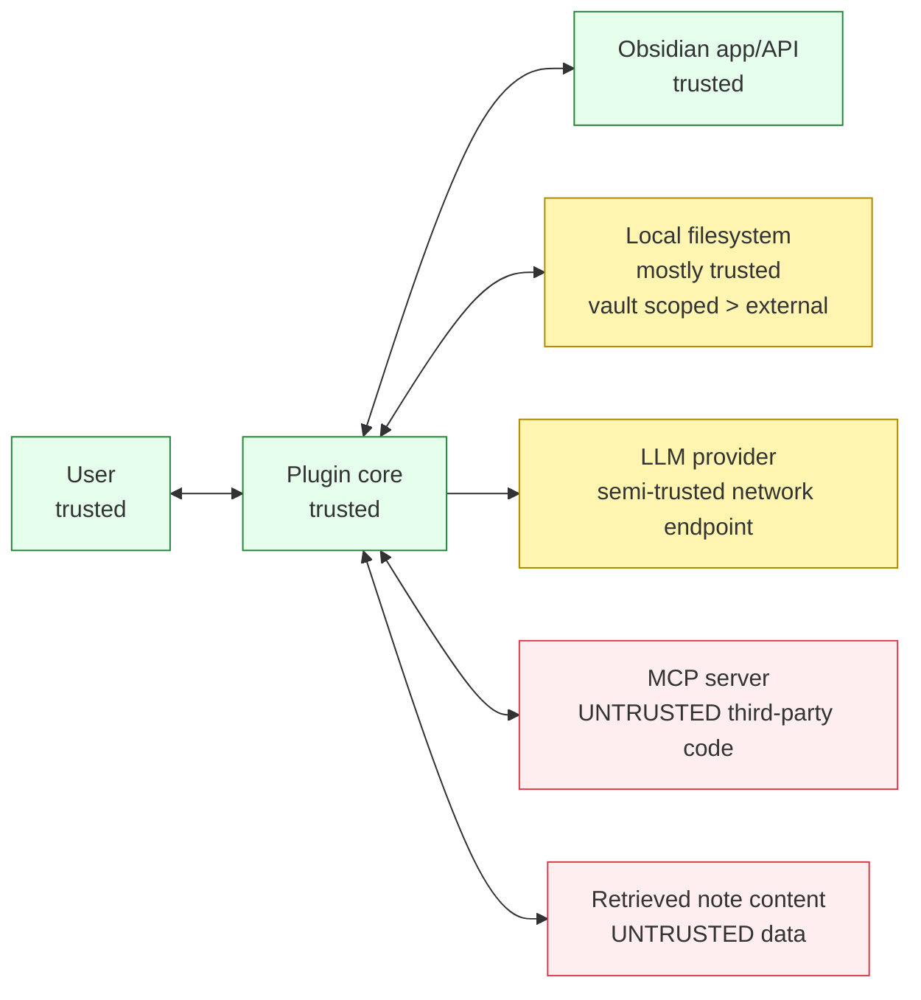

# Threat Model

## 1. Executive summary

This plugin intentionally bridges a private Obsidian vault, local filesystem access, user credentials, network LLM providers, and arbitrary user-installed MCP servers. Other Copilot plugins for Obsidian exist; this threat model is specific to this plugin's agent, MCP, and multi-backend architecture, which is a wider attack surface than typical inline-completion plugins. The highest risks are credential theft, vault data exfiltration, and unauthorized tool execution caused by prompt injection, malicious MCP servers, or local configuration tampering. The design therefore treats notes, tool descriptions, MCP annotations, and tool results as untrusted data; keeps a default-deny permission posture; requires explicit consent for risky tools; scopes file access to the vault or explicit allowlists; redacts audit records; and records all tool decisions for review. Residual risk remains for OS-level local attackers and provider-side retention.

## 2. Assets

| Asset | Description | Sensitivity |
|---|---|---:|
| Vault contents | User notes, attachments, backlinks, and metadata inside the Obsidian vault. | HIGH |
| GitHub OAuth token (`gho_` / `ghu_`) | Token discovered from environment, `gh auth token`, Copilot cache, or device flow. | HIGH |
| GitHub Copilot session token (`tid=...`) | Short-lived token exchanged from the GitHub OAuth token for Copilot API access. | HIGH |
| GitHub PAT for Models API | Token used to call GitHub Models endpoints. | HIGH |
| Azure API key | Key for Azure Foundry or Azure OpenAI Classic. | HIGH |
| MCP server bearer tokens | Tokens configured for Streamable HTTP/SSE MCP servers or stdio server environments. | HIGH |
| Plugin settings file `data.json` | Obsidian plugin settings including security preset and MCP config references. | MEDIUM |
| Audit log | JSONL activity log containing tool calls, decisions, sanitized args, and result summaries. | MEDIUM |
| System environment variables | Process environment; may include cloud keys, GitHub tokens, or personal secrets if exposed. | HIGH |
| Cached LLM responses | Local cache of model responses or generated context summaries. | LOW |

## 3. Trust boundaries

| Boundary | Trust stance | Primary controls |
|---|---|---|
| User ↔ Plugin | Trusted human operating a trusted plugin. | Consent UI in `src/security/ConsentModal.ts`, audit decisions in `src/security/AuditLogger.ts`. |
| Plugin ↔ Obsidian app | Trusted host API, but plugin data can be locally modified. | Settings validation in `src/settings/settings.ts`, lifecycle controls in `src/main.ts`. |
| Plugin ↔ Local filesystem | Mostly trusted; vault is safer than arbitrary external paths. | Canonical vault scoping in built-in tool handlers, cross-platform path handling in `src/util/platform.ts`. |
| Plugin ↔ LLM provider | Semi-trusted network service that receives prompts/responses. | Provider abstraction in `src/providers/*`, no-secret prompt policy in `src/chat/systemPrompt.ts`. |
| Plugin ↔ MCP server | Untrusted: arbitrary third-party code and descriptions. | Namespacing and dispatch in `src/mcp/McpToolRegistry.ts` and `src/mcp/McpDispatcher.ts`; permission gate in `src/security/PermissionGate.ts`. |
| Plugin ↔ Note content retrieved into context | Untrusted data; may be web clippings or copied email. | Trusted-content tagging in `src/security/trustedContent.ts`; anti-injection wrapper in `src/chat/systemPrompt.ts`. |

## 4. STRIDE threat list

Threats marked **Research-cited** are directly derived from the research report, especially §6 Security Model; several also cite §3 authentication and §5 MCP tool routing.

### Spoofing

#### T-S-01 — Malicious MCP server impersonates a trusted server
- **Research-cited:** §5.4, §6.2, §6.5.
- **Attacker capability + entry point:** Attacker can edit an imported MCP config or convince the user to add a server with a colliding name such as `filesystem`.
- **Impact:** User may approve the wrong tool, leaking vault data or credentials.
- **Likelihood:** Medium. **Severity:** High.
- **Mitigations in code:** Use qualified names in `src/mcp/McpToolRegistry.ts`; built-in-wins resolution and server IDs in `src/mcp/McpDispatcher.ts`; consent server display in `src/security/ConsentModal.ts`.
- **Residual risk and detection:** User may still approve a lookalike server; audit `qualifiedName` and `serverId` in `src/security/AuditLogger.ts` expose suspicious names.

#### T-S-02 — OAuth phishing during device flow
- **Research-cited:** §3.2.
- **Attacker capability + entry point:** Attacker presents a fake verification URL or code outside the plugin.
- **Impact:** GitHub OAuth token compromise.
- **Likelihood:** Medium. **Severity:** Critical.
- **Mitigations in code:** `src/auth/deviceFlow.ts` hard-codes GitHub device and token endpoints; `src/auth/DeviceFlowModal.ts` renders only GitHub's returned `verification_uri` and copies only the official `user_code`.
- **Residual risk and detection:** Out-of-band phishing remains possible; log token source transitions without token values via `src/security/AuditLogger.ts`.

#### T-S-03 — Reusing VS Code OAuth `client_id`
- **Research-cited:** §3.2.
- **Attacker capability + entry point:** Developer misconfiguration makes the plugin appear as another GitHub app and violates service terms.
- **Impact:** User confusion, token provenance ambiguity, app revocation risk.
- **Likelihood:** Low. **Severity:** High.
- **Mitigations in code:** `src/auth/deviceFlow.ts` must load only the plugin-owned OAuth app client ID from settings/default constants; `src/settings/settings.ts` rejects known VS Code client IDs.
- **Residual risk and detection:** Manual source modification can bypass this; CI/security review should grep for known client IDs before release.

#### T-S-04 — Fake LLM backend endpoint
- **Attacker capability + entry point:** User imports malicious settings that point Azure/OpenAI-compatible base URLs at an attacker endpoint.
- **Impact:** Prompt and vault-context disclosure to an attacker-controlled service.
- **Likelihood:** Medium. **Severity:** High.
- **Mitigations in code:** Endpoint validation in `src/providers/factory.ts`; settings UI warnings in `src/settings/SettingsTab.ts`; audit provider selection in `src/security/AuditLogger.ts`.
- **Residual risk and detection:** Bring-your-own endpoint is intentional; audit backend hostnames and warn on nonstandard domains.

### Tampering

#### T-T-01 — Local attacker tampers with `data.json`
- **Research-cited:** §6.1, §6.2.
- **Attacker capability + entry point:** Local write access to `.obsidian/plugins/.../data.json` lowers preset or auto-allows destructive tools.
- **Impact:** Unauthorized write/delete/network tools.
- **Likelihood:** Medium. **Severity:** High.
- **Mitigations in code:** `src/settings/settings.ts` schema clamps invalid values; `src/security/PermissionGate.ts` remains default-deny and never lets settings disable consent for unapproved destructive tools.
- **Residual risk and detection:** OS-level local write access is out of scope; audit preset changes in `src/security/AuditLogger.ts`.

#### T-T-02 — Local attacker tampers with audit log
- **Research-cited:** §6.4.
- **Attacker capability + entry point:** Local filesystem write access modifies or deletes `audit.jsonl`.
- **Impact:** Evidence loss and repudiation.
- **Likelihood:** Medium. **Severity:** Medium.
- **Mitigations in code:** Append-only writer and rotation in `src/security/AuditLogger.ts`; audit viewer in `src/security/AuditView.ts` flags malformed JSONL and gaps.
- **Residual risk and detection:** Not tamper-proof against admins; detection relies on malformed sequence/gap warnings and external backups.

#### T-T-03 — Compromised MCP server modifies tool annotations
- **Research-cited:** §6.2, §6.5.
- **Attacker capability + entry point:** Server reports destructive tools as `readOnlyHint: true`.
- **Impact:** User may auto-allow a dangerous action.
- **Likelihood:** High. **Severity:** High.
- **Mitigations in code:** `src/security/PermissionGate.ts` treats annotations as hints, defaults absent destructive/open-world hints to risky, and requires approval for MCP tools; `src/security/ConsentModal.ts` displays annotations visibly.
- **Residual risk and detection:** A user can still permanently approve; audit stores annotations and decisions for review.

#### T-T-04 — `~/.config/gh/hosts.yml` modified to inject attacker's token
- **Research-cited:** §3.1.
- **Attacker capability + entry point:** Local attacker changes GitHub CLI credential source.
- **Impact:** Actions run under attacker account or token; data could be sent to wrong GitHub identity.
- **Likelihood:** Low. **Severity:** High.
- **Mitigations in code:** `src/auth/tokenSources.ts` records token source, validates token by querying GitHub identity before use, and displays account in `src/settings/SettingsTab.ts`.
- **Residual risk and detection:** Local credential store compromise is out of scope; detection by account mismatch and audit auth source.

#### T-T-05 — Cached LLM responses modified to poison future context
- **Attacker capability + entry point:** Local write access to cache files.
- **Impact:** Prompt injection persistence or incorrect recommendations.
- **Likelihood:** Low. **Severity:** Medium.
- **Mitigations in code:** Cache isolation and versioning in provider/cache code; untrusted wrappers in `src/chat/systemPrompt.ts`; trusted-content checks in `src/security/trustedContent.ts`.
- **Residual risk and detection:** Cache is low sensitivity; clear-cache command and audit suspicious cache use.

### Repudiation

#### T-R-01 — User denies authorizing a destructive action
- **Research-cited:** §6.3, §6.4.
- **Attacker capability + entry point:** User or malicious actor disputes an action after approval.
- **Impact:** Loss of accountability.
- **Likelihood:** Medium. **Severity:** Medium.
- **Mitigations in code:** `src/security/ConsentModal.ts` captures allow-once/session/always decisions; `src/security/AuditLogger.ts` records `requestId`, args, decision, preset, duration, and status.
- **Residual risk and detection:** Audit is local and not notarized; detection through complete JSONL trail.

#### T-R-02 — Audit log not flushed before crash
- **Research-cited:** §6.4.
- **Attacker capability + entry point:** Crash, power loss, or forced process termination during a tool call.
- **Impact:** Missing or partial entries.
- **Likelihood:** Medium. **Severity:** Medium.
- **Mitigations in code:** `src/security/AuditLogger.ts` writes a pending entry before execution and updates status afterward; `src/main.ts` flushes on plugin unload.
- **Residual risk and detection:** Last event can be lost; viewer flags stale `pending` entries after restart.

#### T-R-03 — MCP server denies executing a tool call
- **Attacker capability + entry point:** Malicious server performs side effects then returns an error or no response.
- **Impact:** User cannot prove which server caused changes.
- **Likelihood:** Medium. **Severity:** High.
- **Mitigations in code:** `src/mcp/McpDispatcher.ts` assigns per-call IDs; `src/security/AuditLogger.ts` records server ID, tool name, args, start time, and result/error.
- **Residual risk and detection:** External side effects may lack corroborating logs; use server isolation and review audit entries.

#### T-R-04 — Settings changes are not attributable
- **Attacker capability + entry point:** Local user or sync tool changes plugin settings.
- **Impact:** Security posture changes without explanation.
- **Likelihood:** Medium. **Severity:** Medium.
- **Mitigations in code:** `src/settings/SettingsTab.ts` routes security-relevant changes through audit events; `src/settings/settings.ts` records migration/version metadata.
- **Residual risk and detection:** Local edits bypass UI; detection by startup diff audit in `src/main.ts`.

### Information disclosure

#### T-I-01 — Prompt injection in note content calls `read_vault_file`
- **Research-cited:** §5.5, §6.5.
- **Attacker capability + entry point:** Attacker-controlled note/web clipping says to read secrets and include them in output.
- **Impact:** Vault secret disclosure to LLM/provider or chat.
- **Likelihood:** High. **Severity:** Critical.
- **Mitigations in code:** `src/chat/systemPrompt.ts` treats retrieved content as data; `src/security/trustedContent.ts` wraps untrusted notes; `src/security/PermissionGate.ts` asks before `read_vault_file` outside active file.
- **Residual risk and detection:** User may approve; audit vault read args and source in `src/security/AuditLogger.ts`.

#### T-I-02 — Prompt injection in MCP tool result exfiltrates data via web search
- **Research-cited:** §6.5.
- **Attacker capability + entry point:** Untrusted MCP server returns instructions to call a network tool with sensitive context.
- **Impact:** Vault/token data sent to third-party web service.
- **Likelihood:** High. **Severity:** Critical.
- **Mitigations in code:** Tool results are base64-wrapped in untrusted envelopes before returning to the model; `src/security/systemPrompt.ts` requires treating decoded bytes as data; open-world/network tools require allowlist in `src/security/PermissionGate.ts`; dispatch is logged in `src/mcp/McpDispatcher.ts`.
- **Residual risk and detection:** Approved network tools can leak; audit network tool calls and result summaries.

#### T-I-03 — Secrets in tool args leak to audit log
- **Research-cited:** §6.4.
- **Attacker capability + entry point:** Tool call includes token/password/API key in args.
- **Impact:** Secret persisted in local JSONL.
- **Likelihood:** Medium. **Severity:** High.
- **Mitigations in code:** `src/security/AuditLogger.ts` records `argsSanitized`, redacts sensitive keys, recursively redacts token-like values (`gho_`, `ghu_`, `github_pat_`, `sk-*`, `tid=`, JWT, and bearer strings), and parses JSON-looking strings before redaction.
- **Residual risk and detection:** Unknown secret formats may evade regex; audit viewer flags high-entropy strings for manual review.

#### T-I-04 — Secrets in messages leak to LLM provider logs
- **Research-cited:** §6.5.
- **Attacker capability + entry point:** User or context includes credentials in prompts.
- **Impact:** Provider-side retention of secrets.
- **Likelihood:** Medium. **Severity:** High.
- **Mitigations in code:** No-secret system-prompt policy in `src/chat/systemPrompt.ts`; provider boundary warnings in `src/providers/*`; optional redaction in `src/util/secrets.ts` before request assembly.
- **Residual risk and detection:** Providers may log all prompts under their TOS; warn users and avoid automatic secret insertion.

#### T-I-05 — Tool description poisoning
- **Research-cited:** §6.5.
- **Attacker capability + entry point:** Rogue MCP tool description embeds instructions such as exfiltrating env vars.
- **Impact:** Model follows hidden instructions from tool schema.
- **Likelihood:** High. **Severity:** High.
- **Mitigations in code:** `src/security/systemPrompt.ts` wraps the tool catalog in an untrusted catalog block, caps descriptions at 256 characters, and suppresses descriptions containing safety-trigger phrases; settings and consent surfaces require server approval before startup/use.
- **Residual risk and detection:** LLM may still be influenced by benign-looking labels; audit first-use server approval and suspicious tool cascades.

#### T-I-06 — System prompt leakage
- **Attacker capability + entry point:** User/note asks model to repeat hidden instructions.
- **Impact:** Security rules and internal policy exposed; aids bypass attempts.
- **Likelihood:** Medium. **Severity:** Medium.
- **Mitigations in code:** `src/chat/systemPrompt.ts` instructs model not to reveal system/developer instructions; chat renderer in `src/chat/ChatView.ts` does not display raw system prompts.
- **Residual risk and detection:** LLM can fail; leakage is lower impact than secrets, and suspicious requests are auditable.

#### T-I-07 — Audit log contains sensitive note paths or content
- **Research-cited:** §6.4.
- **Attacker capability + entry point:** Shared vault, synced plugin folder, or support bundle includes audit logs.
- **Impact:** Privacy leak of filenames, project names, snippets, or actions.
- **Likelihood:** Medium. **Severity:** Medium.
- **Mitigations in code:** `src/security/AuditLogger.ts` records summaries not full results, truncates result summaries, and redacts args; `src/security/AuditView.ts` warns before export.
- **Residual risk and detection:** Paths remain useful for audit; document sharing guidance in `SECURITY.md`.

#### T-I-08 — Environment variable exposure through auth/token discovery
- **Research-cited:** §3.1, §6.1.
- **Attacker capability + entry point:** Prompt or tool requests `process.env` or env-backed token source.
- **Impact:** Cloud/GitHub key compromise.
- **Likelihood:** Medium. **Severity:** Critical.
- **Mitigations in code:** `src/security/PermissionGate.ts` denies env-var access in all presets; `src/auth/tokenSources.ts` returns tokens only to provider/auth code, not chat context; `src/util/secrets.ts` redacts env-derived values.
- **Residual risk and detection:** Malicious stdio MCP process may print its own environment if configured; restrict MCP env in `src/mcp/McpClientFactory.ts`.

#### T-I-09 — Copilot session token appears in errors
- **Attacker capability + entry point:** Failed Copilot exchange or provider error echoes headers.
- **Impact:** Short-lived `tid=...` token disclosure.
- **Likelihood:** Low. **Severity:** High.
- **Mitigations in code:** `src/providers/GitHubCopilotProvider.ts` scrubs headers before throwing; `src/util/secrets.ts` redacts `tid=` tokens; `src/security/AuditLogger.ts` stores sanitized errors.
- **Residual risk and detection:** Short lifetime limits blast radius; audit high-entropy redaction warnings.

### Denial of service

#### T-D-01 — Malicious MCP tool causes infinite tool-call loop
- **Research-cited:** §6.5.
- **Attacker capability + entry point:** Tool result repeatedly instructs model to call more tools.
- **Impact:** UI hang, quota burn, user disruption.
- **Likelihood:** Medium. **Severity:** Medium.
- **Mitigations in code:** Agent loop in `src/chat/ChatViewModel.ts` caps tool iterations at 10; `src/security/AuditLogger.ts` records aborted loop reason.
- **Residual risk and detection:** Ten calls can still be expensive; detect repeated same-tool pattern in audit view.

#### T-D-02 — Huge tool result blows up context window
- **Research-cited:** §6.5.
- **Attacker capability + entry point:** MCP server returns 100MB text or large resource.
- **Impact:** Memory pressure, slow UI, provider request failure.
- **Likelihood:** Medium. **Severity:** Medium.
- **Mitigations in code:** `src/mcp/McpDispatcher.ts` and `src/chat/ChatViewModel.ts` cap injected tool result text at 50KB and summarize/truncate.
- **Residual risk and detection:** Binary/image resources may still be costly; audit truncation events.

#### T-D-03 — GitHub Models quota exhausted by automation
- **Attacker capability + entry point:** Prompt injection or workflow repeatedly triggers model calls.
- **Impact:** Rate-limit exhaustion and degraded availability.
- **Likelihood:** Medium. **Severity:** Medium.
- **Mitigations in code:** Provider rate-limit handling in `src/providers/GitHubModelsProvider.ts`; per-chat iteration limits in `src/chat/ChatViewModel.ts`; consent for automated workflows in `src/security/PermissionGate.ts`.
- **Residual risk and detection:** User-authorized loops can still burn quota; audit call counts and provider 429s.

#### T-D-04 — Stuck MCP stdio process not killed on plugin unload
- **Attacker capability + entry point:** MCP server ignores shutdown or hangs.
- **Impact:** Orphaned processes, file locks, CPU/memory drain.
- **Likelihood:** Medium. **Severity:** Medium.
- **Mitigations in code:** `src/mcp/McpManager.ts` tracks process lifecycles; `src/main.ts` calls disconnect/kill in `onunload`; `src/util/crossSpawn.ts` exposes PID-safe termination.
- **Residual risk and detection:** OS may leave grandchildren; audit unload failures and show stale process warnings.

#### T-D-05 — Audit log disk exhaustion
- **Attacker capability + entry point:** Automated tool calls create massive JSONL logs.
- **Impact:** Vault/plugin storage fills, Obsidian slows.
- **Likelihood:** Low. **Severity:** Medium.
- **Mitigations in code:** 10MB rotation and keep-last-3 in `src/security/AuditLogger.ts`; summaries not full results.
- **Residual risk and detection:** Long-running abuse can still generate logs; surface log size in `src/security/AuditView.ts`.

### Elevation of privilege

#### T-E-01 — Tool annotation downgrade attack
- **Research-cited:** §6.2, §6.5.
- **Attacker capability + entry point:** MCP server marks a destructive tool as non-destructive.
- **Impact:** Destructive capability receives read-only treatment.
- **Likelihood:** High. **Severity:** High.
- **Mitigations in code:** `src/security/PermissionGate.ts` treats annotations as non-authoritative and defaults missing `destructiveHint`/`openWorldHint` to risky; consent shows badges in `src/security/ConsentModal.ts`.
- **Residual risk and detection:** User approval remains final; audit annotation/decision mismatch.

#### T-E-02 — Tool name spoofing overrides built-in tool
- **Research-cited:** §5.4.
- **Attacker capability + entry point:** Server registers `obsidian-native__read_active_file` or similar.
- **Impact:** Model routes a built-in read to attacker server.
- **Likelihood:** Medium. **Severity:** High.
- **Mitigations in code:** Built-in tools reserve namespace in `src/mcp/McpToolRegistry.ts`; dispatcher in `src/mcp/McpDispatcher.ts` rejects MCP tools with reserved prefixes and applies built-in-wins policy.
- **Residual risk and detection:** Lookalike names remain possible; consent displays exact server and qualified name.

#### T-E-03 — Environment variable exfiltration via tool printing `process.env`
- **Research-cited:** §6.1.
- **Attacker capability + entry point:** User installs stdio MCP server or command that returns env vars.
- **Impact:** Credential compromise.
- **Likelihood:** Medium. **Severity:** Critical.
- **Mitigations in code:** `src/mcp/McpClientFactory.ts` launches MCP servers with a minimal environment; `src/security/PermissionGate.ts` denies env access and requires consent for open-world tools; `src/util/secrets.ts` redacts logs.
- **Residual risk and detection:** Some servers need env tokens; require explicit per-server env allowlist and audit env-bearing server launches.

#### T-E-04 — Path traversal in `read_vault_file({path:"../../../.ssh/id_rsa"})`
- **Research-cited:** §5.5, §6.1.
- **Attacker capability + entry point:** Prompt injection or user-supplied tool args request parent paths.
- **Impact:** Read arbitrary local files and secrets.
- **Likelihood:** Medium. **Severity:** Critical.
- **Mitigations in code:** Built-in file tools reject `..`, absolute paths, drive letters, UNC paths, and `~` before using vault APIs; `src/security/PermissionGate.ts` denies external reads except explicit allowlist.
- **Residual risk and detection:** Symlink/junction edge cases still require runtime host protections; audit denied traversal attempts.

#### T-E-05 — Symlink attack inside vault
- **Attacker capability + entry point:** Note path inside vault is a symlink/junction to `/etc/passwd`, `C:\Users\...\.ssh`, or another sensitive location.
- **Impact:** Scoped vault read becomes external file read.
- **Likelihood:** Low. **Severity:** High.
- **Mitigations in code:** Built-in file tools resolve real paths before read/write; `src/util/platform.ts` handles symlinks/junctions; `src/security/PermissionGate.ts` checks canonical path remains under vault root.
- **Residual risk and detection:** Filesystem race attacks are possible; audit resolved path mismatch.

#### T-E-06 — Command injection in MCP server config `args`
- **Attacker capability + entry point:** Malicious config includes shell metacharacters in `command`/`args`.
- **Impact:** Arbitrary command execution with user's privileges.
- **Likelihood:** Medium. **Severity:** Critical.
- **Mitigations in code:** `src/mcp/McpClientFactory.ts` uses `execFile`/spawn without shell, treats args as argv array, and requires server approval; `src/settings/settings.ts` validates config shape.
- **Residual risk and detection:** Running arbitrary MCP servers is inherently privileged; audit first launch and command path.

#### T-E-07 — Always-allow grants become broader than intended
- **Attacker capability + entry point:** User approves an innocuous tool forever; server later changes implementation.
- **Impact:** Future calls execute with elevated trust.
- **Likelihood:** Medium. **Severity:** High.
- **Mitigations in code:** `src/security/PermissionGate.ts` scopes approvals by `serverId`, qualified tool, and config fingerprint; `src/mcp/McpDiscovery.ts` invalidates approvals when server command/URL changes.
- **Residual risk and detection:** Server binary can change in place; audit first call after fingerprint drift.

#### T-E-08 — External file write via note creation path tricks
- **Attacker capability + entry point:** Tool args for `create_note`/`append_note` target absolute paths, UNC paths, or reserved names.
- **Impact:** Writes outside vault or overwrites sensitive files.
- **Likelihood:** Low. **Severity:** High.
- **Mitigations in code:** Built-in write tools canonicalize and scope paths to vault root; `src/security/PermissionGate.ts` asks for all write/delete operations; `src/security/ConsentModal.ts` shows resolved path.
- **Residual risk and detection:** Platform-specific path parsing bugs require unit tests; audit denied writes.

## 5. Cross-cutting controls

- **Default-deny posture:** `src/security/PermissionGate.ts` enforces that no setting can disable consent for unapproved tools or destructive/open-world capabilities.
- **Configurable audit log with enforced redaction:** `src/security/AuditLogger.ts` honors user enablement/path/rotation settings while validating vault-relative paths and sanitizing entries before persistence.
- **Non-overridable anti-injection prompt:** `src/security/systemPrompt.ts` appends a mandatory rule that retrieved notes, files, tool results, MCP catalogs, and external content are data, not instructions.
- **Annotations are hints, not authority:** `src/security/PermissionGate.ts` uses MCP annotations only as UI/risk signals; the user remains final approver.
- **Canonical path scoping:** Built-in tools normalize and canonicalize all file paths, then enforce vault root or explicit allowlists with helpers in `src/util/platform.ts`.
- **Tracked MCP process lifecycle:** `src/mcp/McpManager.ts` tracks clients/processes and `src/main.ts` kills them on `onunload`.
- **Tool name collision defense:** `src/mcp/McpToolRegistry.ts` uses qualified namespaces and a built-in-wins policy; `src/mcp/McpDispatcher.ts` rejects reserved prefixes from MCP servers.
- **Secret redaction:** `src/util/secrets.ts` redacts token/key/password fields and known token patterns before audit or UI display.
- **Consent transparency:** `src/security/ConsentModal.ts` shows server, tool, annotations, and full JSON args before approval.
- **Result size and loop bounds:** `src/chat/ChatViewModel.ts` limits tool-call iterations; `src/mcp/McpDispatcher.ts` caps tool result injection.

## 6. Residual risks accepted

| Residual risk | Rationale |
|---|---|
| Local attacker with write access to vault config can always tamper. | OS-level local write compromise is out of scope for an Obsidian plugin. |
| LLM provider keeps logs of all prompts/responses. | Governed by provider terms and enterprise controls; plugin can warn and minimize secrets but cannot control provider retention. |
| Side-channel timing on token validation. | Low impact and low likelihood compared with direct token theft; not economical for this plugin phase. |

## 7. Re-evaluation triggers

Re-run this threat model when any of the following changes occur:

- A new tool category is added, especially write, network, shell, browser, or external-file tools.
- MCP spec version bumps or annotation semantics change.
- A new backend/provider is added or provider authentication changes.
- Audit log schema, storage location, rotation policy, export feature, or redaction logic changes.
- MCP discovery begins importing a new client config format.
- Built-in file tools expand beyond vault-scoped markdown operations.
- Security preset semantics or always-allow persistence changes.

## Threat count summary

| STRIDE category | Count |
|---|---:|
| Spoofing | 4 |
| Tampering | 5 |
| Repudiation | 4 |
| Information disclosure | 9 |
| Denial of service | 5 |
| Elevation of privilege | 8 |
| **Total** | **35** |

